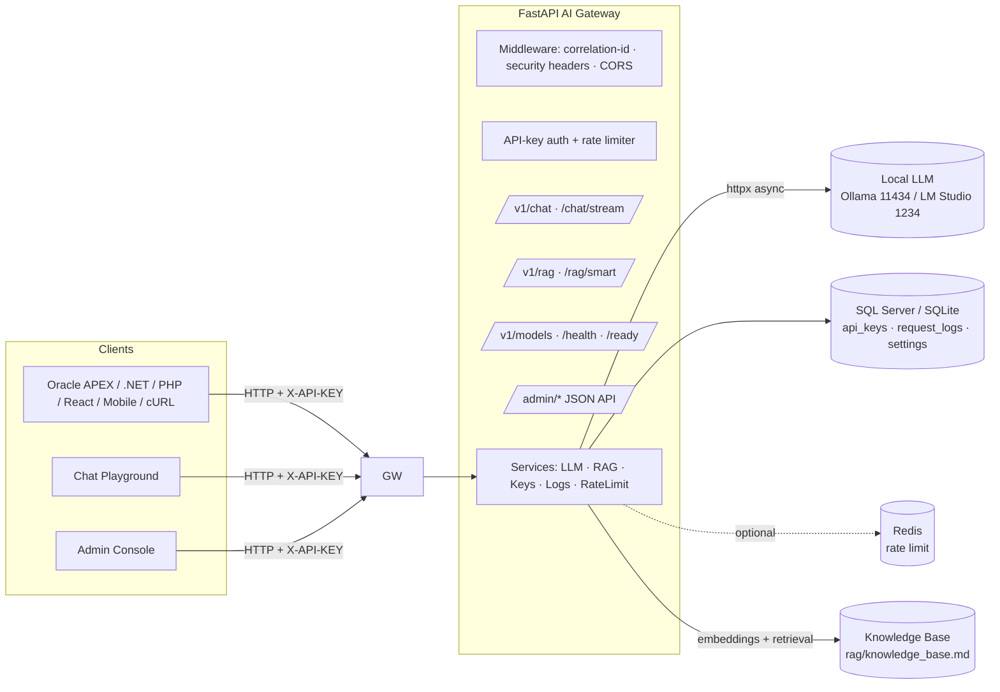

# 🧠 Local LLM AI Gateway — Self-Hosted GPT Platform

> A production-shaped, **self-hosted REST + SSE gateway** in front of **local LLMs**
> (Ollama / LM Studio), with secure API-key management, rate limiting, request logging,
> a futuristic **admin console**, a **ChatGPT-style playground** (voice + vision + file
> upload), and a built-in **RAG** (Retrieval-Augmented Generation) knowledge assistant.
> **100% local — no external AI provider required.**

<p>


</p>

---

## 1. What this project is (functional overview)

An enterprise-style API gateway that sits between client applications and a **locally
running Large Language Model**. It exposes an OpenAI-like REST surface that any stack
(Oracle APEX, PHP/Laravel, ASP.NET, Python, React/Vue, mobile) can consume, while adding
the operational layer real deployments need:

- **Authentication** — issue/manage API keys (hashed at rest, full key shown once).
- **Rate limiting** — per-key (tiered: Free / Pro / Enterprise) and per-IP.
- **Request logging & analytics** — privacy-aware, with a live admin dashboard.
- **Model management** — list installed models, enable/disable, set a default.
- **RAG** — answer questions from a local knowledge base, with automatic fallback to the model.
- **Chat playground** — a ChatGPT-style UI with streaming, voice-to-text, image (vision), and file→KB upload.
- **Admin console** — secure login, analytics, key/model/log management.

---

## 2. Architecture



**Clean layered architecture:** `routers (api) → services → repositories/models`.
Async everywhere I/O happens. Consistent JSON error envelope. Correlation IDs +
structured JSON logs. `/health` (liveness) vs `/ready` (DB + LLM checks).

---

## 3. Tech stack

| Layer | Technology |
|---|---|
| **Backend** | Python 3.11+, FastAPI, SQLAlchemy 2.0 (async), Pydantic v2, Uvicorn |
| **Database** | Microsoft SQL Server 2019+ (LocalDB) via `aioodbc`; SQLite (`aiosqlite`) for dev |
| **LLM** | Ollama (native API) **or** LM Studio / any OpenAI-compatible server — switchable |
| **Embeddings / RAG** | `text-embedding-nomic-embed-text-v1.5` (or any embed model), in-memory cosine retrieval |
| **Cache / Rate limit** | In-memory sliding window; Redis backend (atomic Lua) optional |
| **Frontend** | Server-rendered Jinja2 (admin) + vanilla JS SPA (chat) — no CDN, fully self-contained |
| **Security** | HMAC-SHA256 key hashing, Fernet (AES) key encryption-at-rest, Argon2 (passwords) |
| **DevOps** | Docker, Docker Compose, Nginx reverse proxy |

---

## 4. Backend

- **Routers** (`app/api/routers/`): `chat`, `rag`, `models`, `health`, `admin`.
- **Services** (`app/services/`):
  - `ollama_service.py` — native Ollama client (`/api/generate`, streaming, embeddings).
  - `openai_service.py` — OpenAI-compatible client (LM Studio/vLLM: `/chat/completions`, `/embeddings`, vision).
  - `rag_service.py` — chunk → embed → cosine retrieve → grounded answer (+ smart routing).
  - `key_service.py` — API-key lifecycle (create/list/disable/delete, usage).
  - `log_service.py` — privacy-aware logging + analytics aggregations.
  - `ratelimit.py` — sliding-window limiter (memory or Redis).
- **Core** (`app/core/`): `config` (pydantic-settings), `logging` (JSON + correlation IDs),
  `security` (key gen/hash/encrypt, Argon2), `errors` (envelope + handlers).
- **Pluggable LLM backend:** `LLM_BACKEND=ollama|openai` selects the client at startup.

---

## 5. Database

Async SQLAlchemy 2.0 models; runs on **SQL Server** (prod) or **SQLite** (dev) by
swapping `DATABASE_URL`. Raw DDL lives in [`database/init_db.sql`](database/init_db.sql).

| Table | Purpose | Notable columns |
|---|---|---|
| `api_keys` | API key registry | `key_hash` (HMAC), `key_prefix`, `key_encrypted` (Fernet), `tier`, `rate_limit`, `ip_whitelist`, `status`, `last_used` |
| `request_logs` | Every request | `model`, `endpoint`, `prompt`, `response`, token counts, `status_code`, `response_time_ms`, `ip_address`, `request_id` |
| `settings` | Key/value | model enable/disable list, default model |

All tables carry **soft-delete** (`is_deleted`/`deleted_at`) + **audit** columns
(`created_by/date`, `updated_by/date`), with PKs, unique + check constraints, and indexes.

> **Security:** API keys are never stored raw. Only an HMAC-SHA256 **hash** (for lookup) +
> a short non-secret **prefix** are stored; the full key is additionally kept as a
> reversible **Fernet (AES) ciphertext** so the admin UI can re-copy it — never plaintext.

---

## 6. API reference

Public (require `X-API-KEY`):

| Method | Path | Description |
|---|---|---|
| POST | `/v1/chat` | Chat completion (supports `images` for vision) |
| POST | `/v1/chat/stream` | Streaming chat (SSE) |
| POST | `/v1/rag` | Answer strictly from the knowledge base (+ sources) |
| POST | `/v1/rag/smart` | **RAG-first**: KB if relevant, else fall back to the model |
| POST | `/v1/rag/smart/stream` | Smart RAG, streamed |
| POST | `/v1/rag/documents` | Upload a text/markdown file into the KB + reindex |
| GET | `/v1/rag/status` | Index state (chunks) |
| GET | `/v1/models`, `/v1/models/status` | List / status of installed models |
| GET | `/v1/health`, `/v1/ready` | Liveness / readiness (DB + LLM) |

Admin (require `X-ADMIN-KEY`):

| Method | Path | Description |
|---|---|---|
| POST/GET/DELETE | `/admin/api-keys[/{id}]` | Create / list / revoke keys |
| GET | `/admin/logs` | Paginated, filterable request logs |
| GET | `/admin/stats` | Dashboard analytics |
| GET/POST/PUT | `/admin/models...` | Enable/disable models, set default |
| POST | `/v1/rag/reindex` | Rebuild the RAG index |

Interactive docs: **`/docs`** (Swagger). Consistent error envelope:
`{"success": false, "error": {"code","message","details"}, "request_id"}`.

---

## 7. LLM integration (Ollama + LM Studio)

One interface, two backends:
- **Ollama** (`OLLAMA_BASE_URL`, default `:11434`) — native `/api/generate` streaming + `/api/embeddings`.
- **LM Studio / OpenAI-compatible** (`OPENAI_BASE_URL`, default `:1234/v1`) — `/chat/completions`,
  `/embeddings`, and **vision** (image parts). Set `LLM_BACKEND=openai`.

Handles upstream failures (down / slow / model-missing) → mapped to a clean `502/404`.
Reasoning models (e.g. Gemma QAT) supported; timeouts configurable.

---

## 8. RAG (Retrieval-Augmented Generation)

**LLM + Knowledge Base + Retrieval.** See [`RAG.md`](RAG.md) for the deep dive.

1. `rag/knowledge_base.md` is chunked (overlapping) and embedded once.
2. A question is embedded, cosine-ranked against chunks, top-k become context.
3. The LLM answers **only from that context**, citing `[Source N]`.

**Smart routing** (the *only* path in the chat UI — no manual toggle): every message
searches the KB first; if the best match clears `RAG_MIN_SCORE` the answer is grounded in
the KB, otherwise it gracefully **falls back to the model's general knowledge**. The KB
search is time-boxed by `RAG_TIMEOUT_SECONDS` (default **30s**) — if embedding/retrieval
runs long (cold index, slow embed model) it abandons RAG and answers straight from the
model, so the user never waits. Upload docs at runtime via the chat **+** menu
(→ `POST /v1/rag/documents`).

**Multi-turn chat memory:** the client sends the last ~12 turns of the conversation as
`history`; the gateway renders them into the prompt (KB, model-fallback, and vision paths
all carry it) so the assistant remembers earlier context — "what is my name" resolves from
a prior turn. See [`app/core/history.py`](app/core/history.py).

---

## 9. Frontend

### Admin Console (`/admin/ui`) — server-rendered, dark "AI" theme
- Animated aurora background, glassmorphism, neon charts.
- **Login** (username + password) — exceptional animated page with a neural-network particle canvas.
- **Dashboard** — live system-status (DB/LLM/Redis), count-up KPI cards, request-trend chart,
  status breakdown, model-usage donut, recent activity.
- **API Keys** — KPIs, search/filter, slide-over create, per-key usage, copy full key, revoke.
- **Models** — enable/disable, set default. **Logs** — paginated, filtered.

### Chat Playground (`/chat`) — world-class, self-contained
- **Dual theme** (dark default + light) with a persisted sun/moon toggle; animated aurora
  backdrop, glassmorphism, custom scrollbars, micro-animations.
- **Empty-state hero** with a gradient greeting + clickable suggestion chips.
- Sidebar with chat history (localStorage), model picker, streaming answers with **markdown +
  code blocks + copy**, mobile hamburger + slide-in nav.
- **Fully automatic RAG** (KB-first → model fallback, no toggle) with a source badge
  (📚 knowledge base / 🧠 model / 🖼️ vision) and **multi-turn memory**.
- **"+" tools menu:** 📎 add file to Knowledge Base · 🖼️ attach image (Vision) · ➕ new chat.
- **🎙 Voice-to-text** (Web Speech API, English / বাংলা) — speak, review, then send.

### Integration guide (`/integrate`) — copy-paste client samples
- Live-configurable Base URL / API key / model, injected into ready-to-run snippets for
  **cURL · Python · Python SDK · JavaScript · SSE streaming · .NET Core · .NET MVC · PHP ·
  Oracle APEX · Oracle ADF/Java**. Linked from the admin console's Developer menu.

---

## 10. Security

- API keys: `AI-` + 32 url-safe chars; stored as HMAC hash + prefix (+ Fernet ciphertext). Shown once.
- Passwords: Argon2id. CORS allow-list (no wildcard). Security headers, trusted hosts.
- Per-key IP allow-list. Privacy-aware logging (truncatable/redactable, retention).
- Secrets via `.env` only (committed as `.env.example`); `.env` is git-ignored.

---

## 11. Quick start

```bash
python -m venv .venv && .venv\Scripts\activate          # Windows
pip install -r requirements.txt
copy .env.example .env                                   # set secrets + backend
uvicorn app.main:app --reload
```

- **Dashboard:** http://127.0.0.1:8000/admin/ui  ·  **Chat:** http://127.0.0.1:8000/chat  ·  **Docs:** http://127.0.0.1:8000/docs
- Default DB is SQLite (zero-config). For SQL Server LocalDB, set `DATABASE_URL` (see `.env.example`).
- Default LLM is Ollama; for LM Studio set `LLM_BACKEND=openai` and start its server on `:1234`.

### Docker
```bash
docker compose up --build      # gateway + redis + nginx (LLM runs on host)
```

---

## 12. Configuration (`.env`)

Key settings (full list in `.env.example`): `LLM_BACKEND`, `DATABASE_URL`,
`HMAC_SECRET`, `ADMIN_API_KEY`, `ADMIN_USERNAME`/`ADMIN_PASSWORD`, `OLLAMA_BASE_URL`,
`OPENAI_BASE_URL`, `DEFAULT_MODEL`, `EMBEDDING_MODEL`, `RAG_TOP_K`, `RAG_MIN_SCORE`,
`RAG_TIMEOUT_SECONDS`, `RATE_LIMIT_BACKEND`, `CORS_ORIGINS`, `LOG_*`.

---

## 13. Project structure

```
app/
  api/routers/   chat · rag · models · health · admin
  core/          config · logging · security · errors · history (chat memory)
  db/            base (engine/session) · models
  schemas/       pydantic request/response models
  services/      ollama · openai · rag · key · log · ratelimit · settings
  middleware/    correlation-id · security headers
  admin_ui/      Jinja templates (login, dashboard, keys, logs, models)
  web/           chat playground + integration guide (templates) + favicon
database/        init_db.sql (SQL Server DDL)
docker/          Dockerfile · nginx.conf
rag/             knowledge_base.md
PROJECT_GOALS.md · RAG.md · README.md · RUNCOMMAND.txt
```

---

## 14. Roadmap

- Enterprise track: users/roles/permissions, JWT access+refresh w/ rotation, audit/error logs.
- Persistent vector store for large knowledge bases; web-search tool.
- 90%+ test suite + CI/CD.

---

> Built as a professional, local-first alternative to hosted GPT APIs — keep your data on
> your own hardware while getting the operational features production needs.
